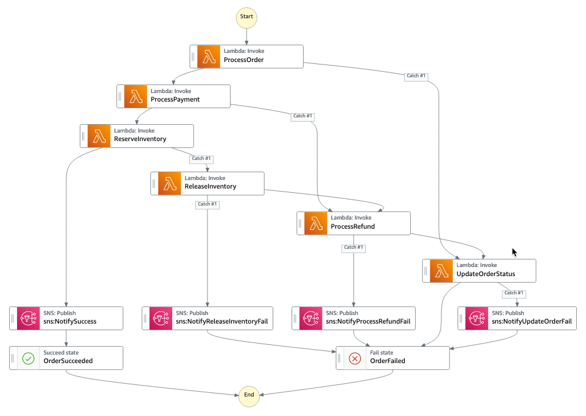

# Managing Long Lived Transactions with AWS Step Functions

AWS Step Functions is a fully managed Serverless workflow management service for managing long running processes and coordinating the components of distributed applications and microservices using visual workflows. But did you know it can also help you deal with the complexities of dealing with a long lived transaction across distributed components in your microservices architecture? In this Builder session, you will learn how AWS Step Function can help us implement the Saga design pattern.

## What problems are we trying to solve?

When building cloud-based distributed architectures, one of the questions we need to ask ourselves is how do we maintain data consistency across microservices that have their own database / persistence mechanism? We do not have support for Distributed Transaction Coordinators (DTC) or two-phase commit protocols responsible for coordinating transactions across multiple cloud resources. We need a mechanism coordinate multiple local transactions.

### What is the Saga pattern?

A Saga is a design pattern for dealing with “long-lived transactions” (LLT), published by Garcia-Molina and Salem in 1987. Their original paper can be found here [https://www.cs.cornell.edu/andru/cs711/2002fa/reading/sagas.pdf](https://www.cs.cornell.edu/andru/cs711/2002fa/reading/sagas.pdf).

  > “LLT is a saga if it can be written as a sequence of transactions that can be interleaved with other transactions.” (Garcia-Molina, Salem 1987)

Fundamentally it is a failure management pattern, that provides us the means to establish semantic consistency in our distributed applications by providing compensating transactions for every transaction where you have more than one collaborating services or functions.

### Why AWS Step Functions?

AWS Step Functions provide us with a mechanism for dealing with long-lived transactions, by providing us with the ability to build fully managed state machines that:

* coordinate the components of distributed applications and microservices
* allowing us to build our state machines using visual workflows
* provides us with a way to manage state and deal with failure

## Sample application

### Scenario

You are creating an e-commerce application and are processing an order. This requires you to update order status, process a credit card transaction and update inventory levels. Each state integrates with a different backend with its own local transaction. You need to treat these as a single, distributed transaction.

### Learning objectives

The goal is to demonstrate: 

* How to create a state machine that implements the Saga pattern
* Understand how to use error handling and retry functionality using AWS Step Functions
* Configure Task states to execute pre-provisioned AWS Lambda functions

### Get started

1. Read the [Setup Information](/docs/setup.md) to deploy the artefacts necessary to complete this session.
1. Use the [Session Guide](/docs/guide.md) to assist you as you create your saga implementation for the e-commerce application scenario.

## Additional Step Functions resources and reference architectures

* [GitHub: AWS Step Function Samples](https://github.com/aws-samples/aws-stepfunctions-examples/)
* [GitHub: AWS Step Functions Plagiarism Demo .NET Core](https://github.com/aws-samples/aws-step-functions-plagiarism-demo-dotnetcore)
* [Documentation: AWS Step Functions Developer Guide](https://docs.aws.amazon.com/step-functions/latest/dg/welcome.html)
* [Documentation: AWS Step Function Tutorials](https://docs.aws.amazon.com/step-functions/latest/dg/tutorials.html)
* [Specification: Amazon States Language](https://states-language.net/spec.html)
* [Tools: statelint](https://github.com/awslabs/statelint)

## License Summary

This sample code is made available under a modified MIT license. See the [LICENSE](LICENSE) file.
