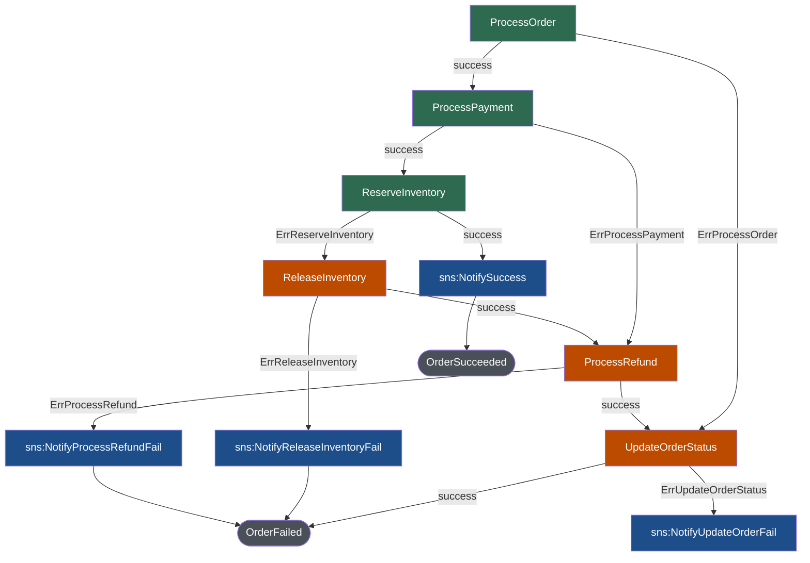
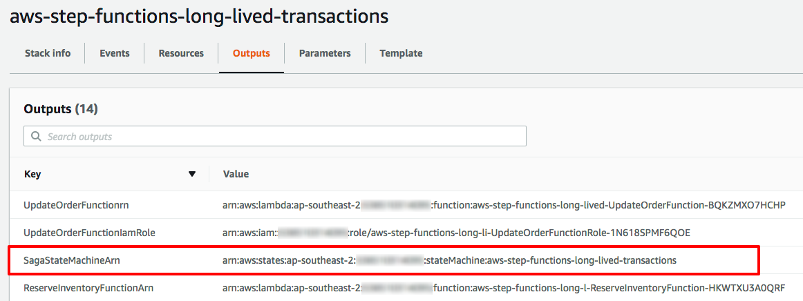

# Session Guide

## What's in this repository?

This is a sample template for Managing Long Lived Transactions with AWS Step Functions. Below is a brief explanation of what we have created for you:

``` bash
.
├── CODE_OF_CONDUCT.md
├── CONTRIBUTING.md
├── LICENSE
├── README.md
├── docs                    <-- # Workshop guide and setup instructions
├── inventory-release       <-- # Lambda function code represents compensating transaction to release inventory
│   ├── ...
│   └── main.go
├── inventory-reserve       <-- # Lambda function code represents compensating transaction to release inventory
│   ├── ...
│   └── main.go
├── models                  <-- # Models package that defines the types used by the various functions and state data
│   ├── ...
│   ├── inventory.go
│   ├── order.go
│   └── payment.go
├── order-new               <-- # Lambda function code represents task to create a new order and set status to "new order"           
│   ├── ...  
│   └── main.go
├── order-update            <-- # Lambda function code represents compensating transaction for orders. 
│   ├── ...                     # Sets order status to "pending"
│   └── main.go                                
├── payment-credit          <-- # Lambda function code represents the compensating transaction to refund customer order
│   ├── ...
│   └── main.go
├── payment-debit           <-- # Lambda function code represents task to process financial transaction for the order
│   ├── ...
│   └── main.go
├── statemachine
│   └── llt.asl.yaml        <-- # Step Functions state machine definition (JSONata + workflow variables)
├── go.work                 <-- # Go workspace tying the per-function modules and models together for local development
├── template.yaml           <-- # AWS SAM template for defining and deploying serverless application resources
└── ...

```

## Amazon States Language

A full description of the how to describe your state machine can be found on the [Amazon States Language specification](https://states-language.net/spec.html).

This sample's state machine ([statemachine/llt.asl.yaml](../statemachine/llt.asl.yaml)) uses the **JSONata** query language (`"QueryLanguage": "JSONata"`) together with [workflow variables](https://docs.aws.amazon.com/step-functions/latest/dg/workflow-variables.html): after each successful transaction the order payload is assigned to an `$order` variable, and every compensating transaction is invoked with `` — so compensations always receive a clean order payload, and error details travel separately in an `$error` variable.

### Useful snippets

#### Task state

The Task State (identified by "Type":"Task") causes the interpreter to execute the work identified by the state's "Resource" field. With JSONata, inputs are built with `Arguments` and the state's result is shaped with `Output`; `Assign` stores values in workflow variables.

```json
"ProcessOrder": {
  "Comment": "First transaction to save the order and set the order status to new",
  "Type": "Task",
  "Resource": "arn:aws:states:::lambda:invoke",
  "Arguments": {
    "FunctionName": "[NEW ORDER FUNCTION ARN]",
    "Payload": ""
  },
  "Output": "",
  "Assign": {
    "order": ""
  },
  "TimeoutSeconds": 10,
  "Next": "ProcessPayment"
}
```

#### Catch
Any state can encounter runtime errors. Errors can arise because of state machine definition issues, task failures (e.g. an exception thrown by a Lambda function) or because of transient issues, such as network partition events. In JSONata mode, a Catch clause can `Assign` the error output (`$states.errorOutput`) to a variable instead of splicing it into the payload:

```json
"Catch": [
  {
    "ErrorEquals": ["ErrProcessOrder"],
    "Assign": {
      "error": ""
    },
    "Next": "UpdateOrderStatus"
  }
]
```

#### Retry
Task States and Parallel States MAY have a field named "Retry", whose value MUST be an array of objects, called Retriers.

When a state reports an error, the interpreter scans through the Retriers and, when the Error Name appears in the value of a Retrier's "ErrorEquals" field, implements the retry policy described in that Retrier. Use `JitterStrategy: FULL` to randomize waits (preventing thundering herds) and `MaxDelaySeconds` to cap the backoff — and make sure the worst-case retry schedule fits inside the state machine's `TimeoutSeconds`.

```json
"Retry": [{
  "ErrorEquals": [
    "Lambda.ServiceException",
    "Lambda.AWSLambdaException",
    "Lambda.SdkClientException"
  ],
  "IntervalSeconds": 2,
  "MaxAttempts": 3,
  "BackoffRate": 2.0,
  "MaxDelaySeconds": 8,
  "JitterStrategy": "FULL"
  }],
  "Catch": [{
    "ErrorEquals": ["ErrReleaseInventory"],
    "Assign": { "error": "" },
    "Next": "sns:NotifyReleaseInventoryFail"
  }
]
```

#### Retries and idempotency

Step Functions retries mean a Task can invoke its Lambda function more than once for the same order — retries deliver *at-least-once* execution. Any state the task writes must therefore be idempotent, or each retry creates a duplicate record.

This sample derives each payment and inventory `transaction_id` deterministically (a UUIDv5 computed from the `order_id` and the transaction type — see `models.TransactionID`) instead of generating a random ID per invocation. Because DynamoDB's `PutItem` overwrites items with the same key, a retried debit or reservation overwrites its own prior record instead of double-charging the customer or double-reserving stock.

## Custom Errors

The following is a list of all the custom errors thrown by the application and can be used in your state machine.

* `ErrProcessOrder` represents a process order error
* `ErrUpdateOrderStatus` represents a process order error
* `ErrProcessPayment` represents a process payment error
* `ErrProcessRefund` represents a process payment refund error
* `ErrReserveInventory` represents a inventory update error
* `ErrReleaseInventory` represents a inventory update reversal error

## Testing Scenarios

The AWS Step Functions implementation has been configured for you to be easily test the various scenarios of the saga implementation. Modifying your `order_id` with a specified prefix will trigger an error in the each Task.

The full state machine, including every compensation edge:


```mermaid
flowchart TD
    ProcessOrder -->|success| ProcessPayment
    ProcessOrder -->|ErrProcessOrder| UpdateOrderStatus
    ProcessPayment -->|success| ReserveInventory
    ProcessPayment -->|ErrProcessPayment| ProcessRefund
    ReserveInventory -->|success| NotifySuccess["sns:NotifySuccess"]
    ReserveInventory -->|ErrReserveInventory| ReleaseInventory
    NotifySuccess --> OrderSucceeded([OrderSucceeded])
    ReleaseInventory -->|success| ProcessRefund
    ReleaseInventory -->|ErrReleaseInventory| NotifyReleaseFail["sns:NotifyReleaseInventoryFail"]
    ProcessRefund -->|success| UpdateOrderStatus
    ProcessRefund -->|ErrProcessRefund| NotifyRefundFail["sns:NotifyProcessRefundFail"]
    UpdateOrderStatus -->|success| OrderFailed([OrderFailed])
    UpdateOrderStatus -->|ErrUpdateOrderStatus| NotifyUpdateFail["sns:NotifyUpdateOrderFail"]
    NotifyReleaseFail --> OrderFailed
    NotifyRefundFail --> OrderFailed

    classDef forward fill:#2d6a4f,color:#fff
    classDef compensation fill:#bc4b00,color:#fff
    classDef notify fill:#1d4e89,color:#fff
    classDef terminal fill:#495057,color:#fff
    class ProcessOrder,ProcessPayment,ReserveInventory forward
    class UpdateOrderStatus,ProcessRefund,ReleaseInventory compensation
    class NotifySuccess,NotifyReleaseFail,NotifyRefundFail,NotifyUpdateFail notify
    class OrderSucceeded,OrderFailed terminal
```

Each scenario drives the execution down a specific path:

OrderID Prefix | Will error with | Example | Expected state path
------------ | ------------- | --- | ---
1 | ErrProcessOrder | 1ae4501d-ed92-4b27-bf0e-fd978ed45127 | ProcessOrder → UpdateOrderStatus → OrderFailed
11 | ErrUpdateOrderStatus | 11328abd-368d-43fd-bd4f-db15b5b63951 | ProcessOrder → UpdateOrderStatus → sns:NotifyUpdateOrderFail → OrderFailed
2 | ErrProcessPayment | 20b0b599-441b-45c3-910e-ad63fe992c43 | ProcessOrder → ProcessPayment → ProcessRefund → UpdateOrderStatus → OrderFailed
22 | ErrProcessRefund | 222f741b-0292-4f93-a2f7-503f92486955 | ProcessOrder → ProcessPayment → ProcessRefund → sns:NotifyProcessRefundFail → OrderFailed
3 | ErrReserveInventory | 3a7dc768-6f32-495d-a140-3d330c246f50 | ProcessOrder → ProcessPayment → ReserveInventory → ReleaseInventory → ProcessRefund → UpdateOrderStatus → OrderFailed
33 | ErrReleaseInventory | 33a49007-a815-4079-9b9b-e30ae7eca11f | ProcessOrder → ProcessPayment → ReserveInventory → ReleaseInventory → sns:NotifyReleaseInventoryFail → OrderFailed
4-9 | No error | 47063fe3-56d9-4c51-b91f-71929834ce03 | ProcessOrder → ProcessPayment → ReserveInventory → sns:NotifySuccess → OrderSucceeded

> **Tip:** When inspecting an execution in the Step Functions console, open the **Variables** panel (or a state's input) to watch the `$order` and `$error` workflow variables the saga uses to pass state to compensating transactions.

### Invoking your Step Function via CLI

The AWS CLI command will trigger a execution of your state machine. Make sure you substitute the ARN for the state machine in your account. You can find the ARN in the AWS CloudFormation Output section or in the AWS Step Functions console.



> `--region` must match the region you have deployed the application stack into. This is optional if you're using your default region.

``` bash
aws stepfunctions start-execution \
    --state-machine-arn "arn:aws:states:[REGION]:[ACCOUNT NUMBER]:stateMachine:[STATEMACHINE-NAME]" \
    --input "{\"order_id\": \"40063fe3-56d9-4c51-b91f-71929834ce03\", \"order_date\": \"2018-10-19T10:50:16+08:00\", \"customer_id\": \"8d04ea6f-c6b2-4422-8550-839a16f01feb\", \"items\": [{ \"item_id\": \"567\", \"qty\": 1.0, \"description\": \"Cart item 1\", \"unit_price\": 199.99 }]}" \
    --region [AWS_REGION]
```

**[DOWNLOAD SCENARIO CLI COMMANDS](cli-commands.txt)**

## How else can you implement this solution?

Is there any other way you can think of how to break this problem down? What other features of Step Functions could be employed to implement a saga pattern?
