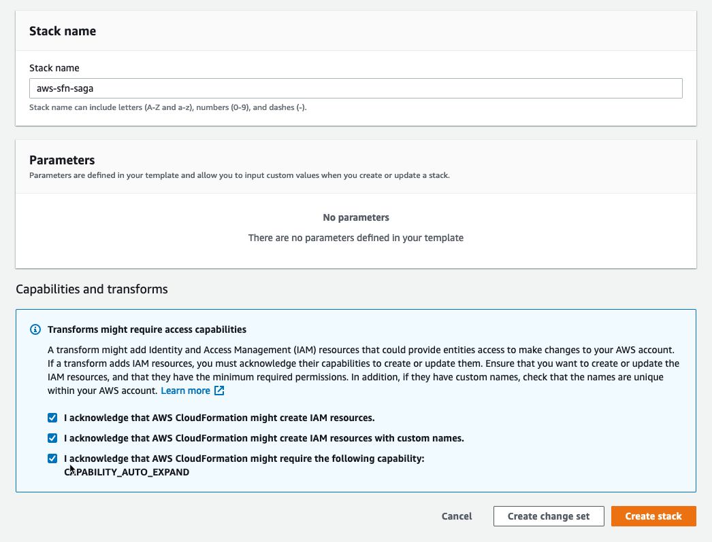

# Setup Information

## Using AWS CloudFormation (preferred)

The easiest way to get started is to launch an AWS CloudFormation template that will deploy the resources for this workshop.

Region| Launch
------|-----
US East (N. Virginia) | [](https://console.aws.amazon.com/cloudformation/home?region=us-east-1#/stacks/create/review?stackName=aws-sfn-saga&templateURL=https://s3.amazonaws.com/aws-step-functions-long-lived-transactions-us-east-1/template.yaml)
US West (Oregon) | [](https://console.aws.amazon.com/cloudformation/home?region=us-west-2#/stacks/create/review?stackName=aws-sfn-saga&templateURL=https://s3-us-west-2.amazonaws.com/aws-step-functions-long-lived-transactions-us-west-2/template.yaml)
Asia Pacific (Sydney) | [](https://console.aws.amazon.com/cloudformation/home?region=ap-southeast-2#/stacks/create/review?stackName=aws-sfn-saga&templateURL=https://s3-ap-southeast-2.amazonaws.com/aws-step-functions-long-lived-transactions-ap-southeast-2/template.yaml)

### CloudFormation Setup Instructions

1. Click the **Launch Stack** link above for the region of your choice.

1. Name the stack (or leave the default `aws-sfn-saga`)

1. In the Capabilities section acknowledge that CloudFormation will create IAM resources and click **Create**.
    

1. Select `Create Change Set`

1. Once the Change Set has been successfully created, select `Execute` to create the stack.

## Deploy from Source
Alternatively, you can deploy the source from you local development environment. Please note, this requires the following environment setup.

### Requirements

* [aws-cli](https://aws.amazon.com/cli/) already configured with Administrator permissions.
* [sam-cli](https://docs.aws.amazon.com/serverless-application-model/index.html) AWS SAM CLI tool for local development and testing of Serverless applications
* [Docker installed](https://www.docker.com/community-edition)
* [Golang](https://golang.org)
* Make (see instructions below)

### Installing SAM CLI

AWS SAM provides you with a command line tool, the AWS SAM CLI, that makes it easy for you to create and manage serverless applications. You need to install and configure a few things in order to use the AWS SAM CLI.

To install the AWS SAM CLI, see the following instructions for your development host:

* [Installing the AWS SAM CLI on Linux](https://docs.aws.amazon.com/serverless-application-model/latest/developerguide/serverless-sam-cli-install-linux.html)
* [Installing the AWS SAM CLI on Windows](https://docs.aws.amazon.com/serverless-application-model/latest/developerguide/serverless-sam-cli-install-windows.html)
* [Installing the AWS SAM CLI on macOS](https://docs.aws.amazon.com/serverless-application-model/latest/developerguide/serverless-sam-cli-install-mac.html)

### Installing Golang

Please ensure Go 1.x (where 'x' is the latest version) is installed as per the instructions on the official golang website: https://golang.org/doc/install

A quick-start way would be to use Homebrew, chocolatey or your linux package manager.

#### Configuring GoPATH

In order to build the source locally you need to set up our Go development environment.

Follow the instructions as outlined here https://github.com/golang/go/wiki/SettingGOPATH

### Clone the repository

Once you have you GOPATH configured clone the builder session repository into the following directory under your GOPATH

```shell
mkdir $GOPATH/src/github.com/aws-samples
cd $GOPATH/src/github.com/aws-samples
git clone https://github.com/aws-samples/aws-step-functions-long-lived-transactions.git
```

### Deploy the sample application
To build and deploy your application for the first time, run the following in your shell:

``` bash
sam build
sam deploy --guided

Configuring SAM deploy
======================

        Looking for config file [samconfig.toml] :  Found
        Reading default arguments  :  Success

        Setting default arguments for 'sam deploy'
        =========================================
        Stack Name [sfn-saga]: 
        AWS Region [ap-southeast-2]: 
        #Shows you resources changes to be deployed and require a 'Y' to initiate deploy
        Confirm changes before deploy [y/N]: N
        #SAM needs permission to be able to create roles to connect to the resources in your template
        Allow SAM CLI IAM role creation [Y/n]: Y
        Save arguments to configuration file [Y/n]: Y
        SAM configuration file [samconfig.toml]: 
        SAM configuration environment [default]: 
```

The first command will build the source of your application. The second command will package and deploy your application to AWS, with a series of prompts:

* **Stack Name**: The name of the stack to deploy to CloudFormation. This should be unique to your account and region, and a good starting point would be something matching your project name.

* **AWS Region**: The AWS region you want to deploy your app to.

* **Confirm changes before deploy**: If set to yes, any change sets will be shown to you before execution for manual review. If set to no, the AWS SAM CLI will automatically deploy application changes.

* **Allow SAM CLI IAM role creation**: Many AWS SAM templates, including this example, create AWS IAM roles required for the AWS Lambda function(s) included to access AWS services. By default, these are scoped down to minimum required permissions. To deploy an AWS CloudFormation stack which creates or modifies IAM roles, the `CAPABILITY_IAM` value for `capabilities` must be provided. If permission isn't provided through this prompt, to deploy this example you must explicitly pass `--capabilities CAPABILITY_IAM` to the `sam deploy` command.

* **Save arguments to samconfig.toml**: If set to yes, your choices will be saved to a configuration file inside the project, so that in the future you can just re-run `sam deploy` without parameters to deploy changes to your application.

The following command describes the outputs defined within the cloudformation stack:

```shell
aws cloudformation describe-stacks \
    --stack-name aws-sfn-saga --query 'Stacks[].Outputs'
```

## Completion

Once you have successfully deployed the functions, go ahead and start testing the saga.

See the [Session Guide](guide.md) for more information.

## Clean up

To delete the sample application that you created, use the AWS CLI. Assuming you used your project name for the stack name, you can run the following:

```bash
aws cloudformation delete-stack --stack-name aws-sfn-saga
```
